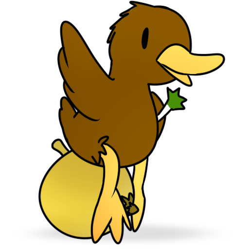

# SuperDUX

SuperDUX is a Qt-based interface of [SameBoy], a free and accurate Game Boy and
Game Boy Color emulator.

## Features
* Supports many of [SameBoy's core features]
   * Highly accurate Game Boy and Game Boy Color emulation
       * High-level Super Game Boy emulation for games that support it
   * Save states, including BESS save states which can be used interchangeably
     with other emulators such as BGB
   * High pass audio filters
   * Color correction
   * SRAM support
   * RTC support
   * Rumble support
   * Rewind support
   * Game Boy Printer support
       * Can save printer feeds as a PNG image or copy to clipboard
   * Built-in boot ROMs, supporting palette switching for both DMG and CGB
* Controller support
   * Per-controller configuration (based on name)
   * Multiple buttons/axes per control
   * Analog turbo and slowdown
* Debugging features
   * Debugger
      * Disassembles into RGBDS-compatible assembly
      * Display and manipulate CPU registers
      * Supports creating breakpoints
      * Supports tracing breakpoints and recording traces into a CSV file
      * Backtrace
   * VRAM (video RAM) viewer
      * Tileset preview (using automatic palettes or specific palettes)
         * Displays metadata such as memory address, bank, usage, etc.
      * Tilemap preview (background, window, as well as specific tilemaps)
      * Sprite preview (also shows coordinates, flipping, and tileset info)
      * Palette preview (shows all background palettes and OAM/sprite palettes)

[SameBoy's core features]: https://sameboy.github.io/features/

Note that this interface is a work-in-progress. More features are (hopefully) to
come.

## Building

Build requirements:
* CMake
* Python
* C11 and C++20 compiler
* Qt6
    * You may build for Qt5 with -DBUILD_QT5_VERSION, but this is unsupported
* [SDL] version 2.0.16 or later
* [SameBoy]\*
    * [RGBDS]  (for building SameBoy's boot ROMs)

[SameBoy]: https://github.com/LIJI32/SameBoy
[SDL]:     https://www.libsdl.org/
[RGBDS]:   https://github.com/gbdev/rgbds

\* You need a copy of SameBoy's source code. One is tracked via `git submodule`,
   but you may also choose to use a different version of SameBoy by setting the
   `SAMEBOY_SOURCE_DIR` setting in the CMake cache like this:
   
   `$ cmake <arguments> -DSAMEBOY_SOURCE_DIR=/path/to/sameboy/source`
   
   To clone SuperDUX with the SameBoy repo, run this command:
   
   `$ git clone https://github.com/SnowyMouse/superdux.git --recursive`

   You can update the existing submodule manually with this:
   
   `$ git submodule update --remote`
